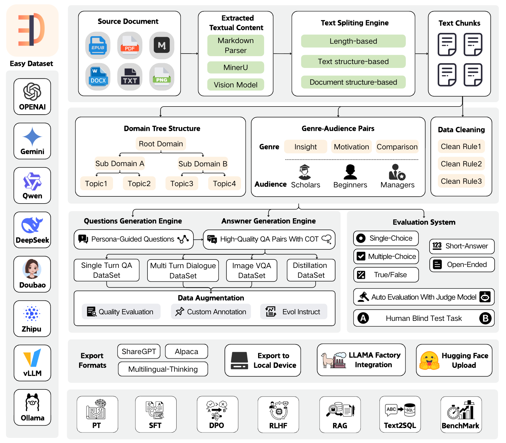

<div align="center">


<a href="https://arxiv.org/abs/2507.04009v1" target="_blank">
  
</a>

<a href="https://trendshift.io/repositories/13944" target="_blank"></a>

**A powerful tool for creating fine-tuning datasets for Large Language Models**

[简体中文](./README.zh-CN.md) | [English](./README.md) | [Türkçe](./README.tr.md)

[Features](#features) • [Quick Start](#local-run) • [Documentation](https://docs.easy-dataset.com/ed/en) • [Contributing](#contributing) • [License](#license)

If you like this project, please give it a Star⭐️, or buy the author a coffee => [Donate](./public/imgs/aw.jpg) ❤️!

</div>

## Overview

Easy Dataset is an application specifically designed for building large language model (LLM) datasets. It features an intuitive interface, along with built-in powerful document parsing tools, intelligent segmentation algorithms, data cleaning and augmentation capabilities. The application can convert domain-specific documents in various formats into high-quality structured datasets, which are applicable to scenarios such as model fine-tuning, retrieval-augmented generation (RAG), and model performance evaluation.



## News

🎉🎉 Easy Dataset Version 1.7.0 launches brand-new evaluation capabilities! You can effortlessly convert domain-specific documents into evaluation datasets (test sets) and automatically run multi-dimensional evaluation tasks. Additionally, it comes with a human blind test system, enabling you to easily meet needs such as vertical domain model evaluation, post-fine-tuning model performance assessment, and RAG recall rate evaluation. Tutorial: [https://www.bilibili.com/video/BV1CRrVB7Eb4/](https://www.bilibili.com/video/BV1CRrVB7Eb4/)

## Features

### 📄 Document Processing & Data Generation

- **Intelligent Document Processing**: Supports PDF, Markdown, DOCX, TXT, EPUB and more formats with intelligent recognition
- **Intelligent Text Splitting**: Multiple splitting algorithms (Markdown structure, recursive separators, fixed length, code-aware chunking), with customizable visual segmentation
- **Intelligent Question Generation**: Auto-extract relevant questions from text segments, with question templates and batch generation
- **Domain Label Tree**: Intelligently builds global domain label trees based on document structure, with auto-tagging capabilities
- **Answer Generation**: Uses LLM API to generate comprehensive answers and Chain of Thought (COT), with AI optimization
- **Data Cleaning**: Intelligent text cleaning to remove noise and improve data quality

### 🔄 Multiple Dataset Types

- **Single-Turn QA Datasets**: Standard question-answer pairs for basic fine-tuning
- **Multi-Turn Dialogue Datasets**: Customizable roles and scenarios for conversational format
- **Image QA Datasets**: Generate visual QA data from images, with multiple import methods (directory, PDF, ZIP)
- **Data Distillation**: Generate label trees and questions directly from domain topics without uploading documents

### 📊 Model Evaluation System

- **Evaluation Datasets**: Generate true/false, single-choice, multiple-choice, short-answer, and open-ended questions
- **Automated Model Evaluation**: Use Judge Model to automatically evaluate model answer quality with customizable scoring rules
- **Human Blind Test (Arena)**: Double-blind comparison of two models' answers for unbiased evaluation
- **AI Quality Assessment**: Automatic quality scoring and filtering of generated datasets

### 🛠️ Advanced Features

- **Custom Prompts**: Project-level customization of all prompt templates (question generation, answer generation, data cleaning, etc.)
- **GA Pair Generation**: Genre-Audience pair generation to enrich data diversity
- **Task Management Center**: Background batch task processing with monitoring and interruption support
- **Resource Monitoring Dashboard**: Token consumption statistics, API call tracking, model performance analysis
- **Model Testing Playground**: Compare up to 3 models simultaneously

### 📤 Export & Integration

- **Multiple Export Formats**: Alpaca, ShareGPT, Multilingual-Thinking formats with JSON/JSONL file types
- **Balanced Export**: Configure export counts per tag for dataset balancing
- **LLaMA Factory Integration**: One-click LLaMA Factory configuration file generation
- **Hugging Face Upload**: Direct upload datasets to Hugging Face Hub

### 🤖 Model Support

- **Wide Model Compatibility**: Compatible with all LLM APIs that follow the OpenAI format
- **Multi-Provider Support**: OpenAI, Ollama (local models), Zhipu AI, Alibaba Bailian, OpenRouter, and more
- **Vision Models**: Support Gemini, Claude, etc. for PDF parsing and image QA

### 🌐 User Experience

- **User-Friendly Interface**: Modern, intuitive UI designed for both technical and non-technical users
- **Multi-Language Support**: Complete Chinese, English, and Turkish language support 🇹🇷
- **Dataset Square**: Discover and explore public dataset resources
- **Desktop Clients**: Available for Windows, macOS, and Linux

## Quick Demo

https://github.com/user-attachments/assets/6ddb1225-3d1b-4695-90cd-aa4cb01376a8

## Local Run

### Download Client

<table style="width: 100%">
  <tr>
    <td width="20%" align="center">
      <b>Windows</b>
    </td>
    <td width="30%" align="center" colspan="2">
      <b>MacOS</b>
    </td>
    <td width="20%" align="center">
      <b>Linux</b>
    </td>
  </tr>
  <tr style="text-align: center">
    <td align="center" valign="middle">
      <a href='https://github.com/ConardLi/easy-dataset/releases/latest'>
        
        <br />
        <b>Setup.exe</b>
      </a>
    </td>
    <td align="center" valign="middle">
      <a href='https://github.com/ConardLi/easy-dataset/releases/latest'>
        
        <br />
        <b>Intel</b>
      </a>
    </td>
    <td align="center" valign="middle">
      <a href='https://github.com/ConardLi/easy-dataset/releases/latest'>
        
        <br />
        <b>M</b>
      </a>
    </td>
    <td align="center" valign="middle">
      <a href='https://github.com/ConardLi/easy-dataset/releases/latest'>
        
        <br />
        <b>AppImage</b>
      </a>
    </td>
  </tr>
</table>

### Install with NPM

1. Clone the repository:

```bash
   git clone https://github.com/ConardLi/easy-dataset.git
   cd easy-dataset
```

2. Install dependencies:

```bash
   npm install
```

3. Start the development server:

```bash
   npm run build

   npm run start
```

4. Open your browser and visit `http://localhost:1717`

### Using the Official Docker Image

1. Clone the repository:

```bash
git clone https://github.com/ConardLi/easy-dataset.git
cd easy-dataset
```

2. Modify the `docker-compose.yml` file:

```yml
services:
  easy-dataset:
    image: ghcr.io/conardli/easy-dataset
    container_name: easy-dataset
    ports:
      - '1717:1717'
    volumes:
      - ./local-db:/app/local-db
      - ./prisma:/app/prisma
    restart: unless-stopped
```

> **Note:** It is recommended to use the `local-db` and `prisma` folders in the current code repository directory as mount paths to maintain consistency with the database paths when starting via NPM.

> **Note:** The database file will be automatically initialized on first startup, no need to manually run `npm run db:push`.

3. Start with docker-compose:

```bash
docker-compose up -d
```

4. Open a browser and visit `http://localhost:1717`

### Building with a Local Dockerfile

If you want to build the image yourself, use the Dockerfile in the project root directory:

1. Clone the repository:

```bash
git clone https://github.com/ConardLi/easy-dataset.git
cd easy-dataset
```

2. Build the Docker image:

```bash
docker build -t easy-dataset .
```

3. Run the container:

```bash
docker run -d \
  -p 1717:1717 \
  -v ./local-db:/app/local-db \
  -v ./prisma:/app/prisma \
  --name easy-dataset \
  easy-dataset
```

> **Note:** It is recommended to use the `local-db` and `prisma` folders in the current code repository directory as mount paths to maintain consistency with the database paths when starting via NPM.

> **Note:** The database file will be automatically initialized on first startup, no need to manually run `npm run db:push`.

4. Open a browser and visit `http://localhost:1717`

## Documentation

- View the demo video of this project: [Easy Dataset Demo Video](https://www.bilibili.com/video/BV1y8QpYGE57/)
- For detailed documentation on all features and APIs, visit our [Documentation Site](https://docs.easy-dataset.com/ed/en)
- View the paper of this project: [Easy Dataset: A Unified and Extensible Framework for Synthesizing LLM Fine-Tuning Data from Unstructured Documents](https://arxiv.org/abs/2507.04009v1)

## Community Practice

- [Complete test set generation and model evaluation with Easy Dataset](https://www.bilibili.com/video/BV1CRrVB7Eb4/)
- [Easy Dataset × LLaMA Factory: Enabling LLMs to Efficiently Learn Domain Knowledge](https://buaa-act.feishu.cn/wiki/GVzlwYcRFiR8OLkHbL6cQpYin7g)
- [Easy Dataset Practical Guide: How to Build High-Quality Datasets?](https://www.bilibili.com/video/BV1MRMnz1EGW)
- [Interpretation of Key Feature Updates in Easy Dataset](https://www.bilibili.com/video/BV1fyJhzHEb7/)
- [Foundation Models Fine-tuning Datasets: Basic Knowledge Popularization](https://docs.easy-dataset.com/zhi-shi-ke-pu)

## Contributing

We welcome contributions from the community! If you'd like to contribute to Easy Dataset, please follow these steps:

1. Fork the repository
2. Create a new branch (`git checkout -b feature/amazing-feature`)
3. Make your changes
4. Commit your changes (`git commit -m 'Add some amazing feature'`)
5. Push to the branch (`git push origin feature/amazing-feature`)
6. Open a Pull Request (submit to the DEV branch)

Please ensure that tests are appropriately updated and adhere to the existing coding style.

## Join Discussion Group & Contact the Author

https://docs.easy-dataset.com/geng-duo/lian-xi-wo-men

## License

This project is licensed under the AGPL 3.0 License - see the [LICENSE](LICENSE) file for details.

## Citation

If this work is helpful, please kindly cite as:

```bibtex
@misc{miao2025easydataset,
  title={Easy Dataset: A Unified and Extensible Framework for Synthesizing LLM Fine-Tuning Data from Unstructured Documents},
  author={Ziyang Miao and Qiyu Sun and Jingyuan Wang and Yuchen Gong and Yaowei Zheng and Shiqi Li and Richong Zhang},
  year={2025},
  eprint={2507.04009},
  archivePrefix={arXiv},
  primaryClass={cs.CL},
  url={https://arxiv.org/abs/2507.04009}
}
```

## Star History

[](https://www.star-history.com/#ConardLi/easy-dataset&Date)

<div align="center">
  <sub>Built with ❤️ by <a href="https://github.com/ConardLi">ConardLi</a> • Follow me: <a href="./public/imgs/weichat.jpg">WeChat Official Account</a>｜<a href="https://space.bilibili.com/474921808">Bilibili</a>｜<a href="https://juejin.cn/user/3949101466785709">Juejin</a>｜<a href="https://www.zhihu.com/people/wen-ti-chao-ji-duo-de-xiao-qi">Zhihu</a>｜<a href="https://www.youtube.com/@garden-conard">Youtube</a></sub>
</div>
